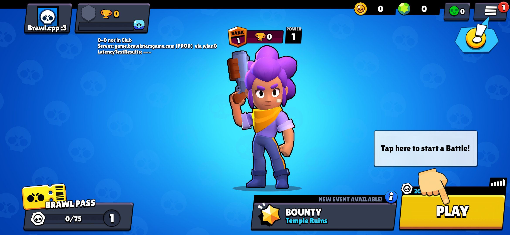

This is the Brawl Stars Core, version V39.999, written in Cpp.

## Requirements

- Gcc (G++)
- Brain..? 🧑🏿‍🦯

## Building

```bash
git clone https://github.com/FMZNkdv/brawl.cpp.git
cd brawl.cpp

g++ -std=c++17 -pthread -I. -I/usr/include/asio Core.cpp Message/*.cpp Stream/*.cpp -o brawl.cpp
```

## Running

```bash
./brawl.cpp
```

The server will start listening on `0.0.0.0:9339` by default.
